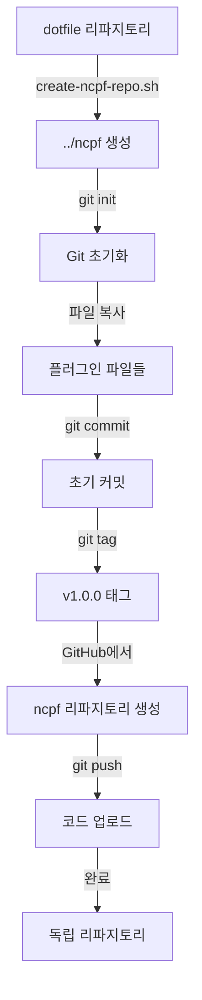

# 옵션 1: 로컬 ncpf 리파지토리 생성 가이드

## 개요

이 방법은 현재 dotfile 리파지토리의 `ncpf.nvim` 디렉토리를 별도의 독립 리파지토리로 분리하는 자동화 스크립트를 사용합니다.

## 작동 원리

### 1단계: 스크립트 실행

```bash
cd /path/to/dotfile  # dotfile 리파지토리 루트로 이동
./create-ncpf-repo.sh
```

### 2단계: 스크립트가 수행하는 작업

스크립트는 다음을 자동으로 처리합니다:

#### A. 검증 단계
- ✅ 현재 디렉토리가 dotfile 리파지토리인지 확인
- ✅ `ncpf.nvim` 디렉토리가 존재하는지 확인
- ✅ 타겟 디렉토리(`../ncpf`)가 이미 존재하면 사용자에게 확인 요청

#### B. 디렉토리 생성
```
현재 위치: /path/to/dotfile
↓
새 디렉토리 생성: /path/to/ncpf
```

**디렉토리 구조**:
```
/path/to/
├── dotfile/              (기존 리파지토리, 변경 없음)
│   ├── ncpf.nvim/       (원본, 그대로 유지)
│   ├── nvim/
│   └── ...
└── ncpf/                 (새로 생성되는 독립 리파지토리)
    ├── lua/
    ├── plugin/
    ├── doc/
    ├── README.md
    └── ...
```

#### C. Git 초기화

1. **새 Git 리파지토리 생성**
   ```bash
   cd ../ncpf
   git init
   git branch -M main
   ```

2. **모든 파일 복사**
   - `ncpf.nvim/` 안의 모든 파일을 `../ncpf/`로 복사
   - 파일 구조는 동일하게 유지
   - 15개 파일 (약 2,003 라인)

3. **초기 커밋 생성**
   ```bash
   git add .
   git commit -m "Initial commit: ncpf.nvim plugin v1.0.0"
   ```

4. **릴리스 태그 생성**
   ```bash
   git tag -a v1.0.0 -m "Initial release: v1.0.0"
   ```

#### D. 안내 메시지 출력

스크립트는 마지막에 다음 단계를 안내합니다.

---

## 상세 단계별 가이드

### 스텝 1: 스크립트 실행 전 준비

현재 위치 확인:
```bash
pwd
# 출력: /home/runner/work/dotfile/dotfile (또는 귀하의 경로)
```

ncpf.nvim 디렉토리 확인:
```bash
ls -la ncpf.nvim/
# 출력: lua/, plugin/, doc/, README.md 등이 보여야 함
```

### 스텝 2: 스크립트 실행

```bash
./create-ncpf-repo.sh
```

**실행 화면 예시**:
```
╔══════════════════════════════════════════════════════════════════════╗
║          NCPF Repository Creation Script                            ║
╚══════════════════════════════════════════════════════════════════════╝

📋 Configuration:
   Repository name: ncpf
   Source directory: ./ncpf.nvim
   Target directory: ../ncpf

📁 Creating new repository directory...
🔧 Initializing Git repository...
📦 Copying plugin files...
   ✓ Using existing .gitignore from plugin
💾 Creating initial commit...

✅ Repository created successfully!

📍 Location: ../ncpf

🚀 Next steps:
...
```

### 스텝 3: 생성된 리파지토리 확인

```bash
cd ../ncpf
pwd
# 출력: /home/runner/work/ncpf

ls -la
# 출력:
# drwxr-xr-x  .git/
# -rw-r--r--  README.md
# -rw-r--r--  README.ko.md
# -rw-r--r--  LICENSE
# drwxr-xr-x  lua/
# drwxr-xr-x  plugin/
# drwxr-xr-x  doc/
# ...

git log --oneline
# 출력: xxxxxxx Initial commit: ncpf.nvim plugin v1.0.0

git tag
# 출력: v1.0.0
```

### 스텝 4: GitHub에 리파지토리 생성

1. **웹 브라우저에서 GitHub 열기**
   - URL: https://github.com/new

2. **리파지토리 설정**
   ```
   Repository name: ncpf
   Description: Neovim C Project File - Automatic C/C++ project configuration
   Visibility: ○ Public ● Private (선택)
   
   ⚠️ 중요: 아래 옵션들은 체크하지 마세요
   □ Add a README file
   □ Add .gitignore
   □ Choose a license
   ```

3. **"Create repository" 클릭**

### 스텝 5: GitHub에 푸시

생성된 GitHub 페이지에 나오는 명령어 대신, 다음을 사용:

```bash
cd ../ncpf  # ncpf 디렉토리로 이동 (아직 아니라면)

# GitHub 원격 저장소 추가
git remote add origin https://github.com/nowpassion/ncpf.git

# 메인 브랜치 푸시
git push -u origin main

# 태그 푸시
git push origin v1.0.0
```

**예상 출력**:
```
Enumerating objects: 20, done.
Counting objects: 100% (20/20), done.
...
To https://github.com/nowpassion/ncpf.git
 * [new branch]      main -> main
 * [new tag]         v1.0.0 -> v1.0.0
```

### 스텝 6: GitHub 리파지토리 설정

1. **About 섹션 업데이트**
   - 리파지토리 페이지 우측 상단 ⚙️ 클릭
   - Description 추가 (이미 되어있음)
   - Website: (선택사항)
   - Topics 추가:
     - `neovim`
     - `neovim-plugin`
     - `c`
     - `cpp`
     - `lsp`
     - `clangd`
     - `cscope`

2. **Release 생성 (선택사항)**
   - "Releases" → "Create a new release"
   - Tag: `v1.0.0` (이미 푸시됨)
   - Title: `v1.0.0 - Initial Release`
   - Description: `CHANGELOG.md` 내용 복사

### 스텝 7: 설치 테스트

다른 사람(또는 다른 머신)에서 테스트:

```lua
-- lazy.nvim 설정에 추가
{
  'nowpassion/ncpf',  -- 새 리파지토리!
  ft = { 'c', 'cpp', 'h', 'hpp', 'cc' },
  config = function()
    require('ncpf.ncpf').init()
  end,
}
```

---

## 전체 프로세스 요약



---

## 스크립트가 하는 일 vs 직접 해야 할 일

### ✅ 스크립트가 자동으로 처리 (create-ncpf-repo.sh)
- [x] 디렉토리 생성 (`../ncpf`)
- [x] Git 초기화
- [x] 파일 복사 (15개 파일)
- [x] 초기 커밋 생성
- [x] v1.0.0 태그 생성
- [x] 다음 단계 안내 출력

### 📝 직접 해야 할 일
1. [ ] GitHub에서 새 리파지토리 생성
2. [ ] `git remote add origin` 실행
3. [ ] `git push -u origin main` 실행
4. [ ] `git push origin v1.0.0` 실행
5. [ ] (선택) GitHub 리파지토리 설정 (Topics, About 등)

---

## 장점

1. **안전함**: 원본 dotfile 리파지토리는 전혀 변경되지 않음
2. **빠름**: 1분 이내 완료
3. **깨끗함**: 새로운 git 히스토리로 시작
4. **자동화**: 반복 가능하고 일관성 있음

---

## 문제 해결

### 문제: "Permission denied" 에러
**해결**:
```bash
chmod +x create-ncpf-repo.sh
./create-ncpf-repo.sh
```

### 문제: "../ncpf already exists" 경고
**해결**: 
- 'y' 입력하여 기존 디렉토리 삭제 후 계속
- 또는 수동으로 삭제: `rm -rf ../ncpf`

### 문제: "ncpf.nvim directory not found"
**해결**: 
- dotfile 리파지토리 루트에서 실행하는지 확인
- `ls ncpf.nvim/` 명령으로 디렉토리 존재 확인

### 문제: Git push 실패
**해결**:
```bash
# GitHub 인증 확인
git config --global user.name "Your Name"
git config --global user.email "your.email@example.com"

# SSH 키 사용 시
git remote set-url origin git@github.com:nowpassion/ncpf.git

# Personal Access Token 사용 시
# https://github.com/settings/tokens 에서 생성 후 사용
```

---

## 다음 단계

리파지토리가 성공적으로 생성되면:

1. **README 확인**
   ```bash
   cd ../ncpf
   cat README.md
   ```

2. **문서 검토**
   - 설치 URL이 올바른지 확인
   - 예제 코드 테스트

3. **커뮤니티 공유**
   - [awesome-neovim](https://github.com/rockerBOO/awesome-neovim)에 PR
   - Reddit r/neovim에 포스트
   - Discord 커뮤니티에 공유

---

## 추가 자료

- **상세 매뉴얼**: `CREATING_NCPF_REPO.md`
- **배포 가이드**: `ncpf.nvim/DISTRIBUTION.md`
- **빠른 시작**: `ncpf.nvim/QUICKSTART.md`
- **마이그레이션**: `ncpf.nvim/MIGRATION.md`

---

## 질문?

더 궁금한 점이 있으시면 언제든 질문해주세요!
